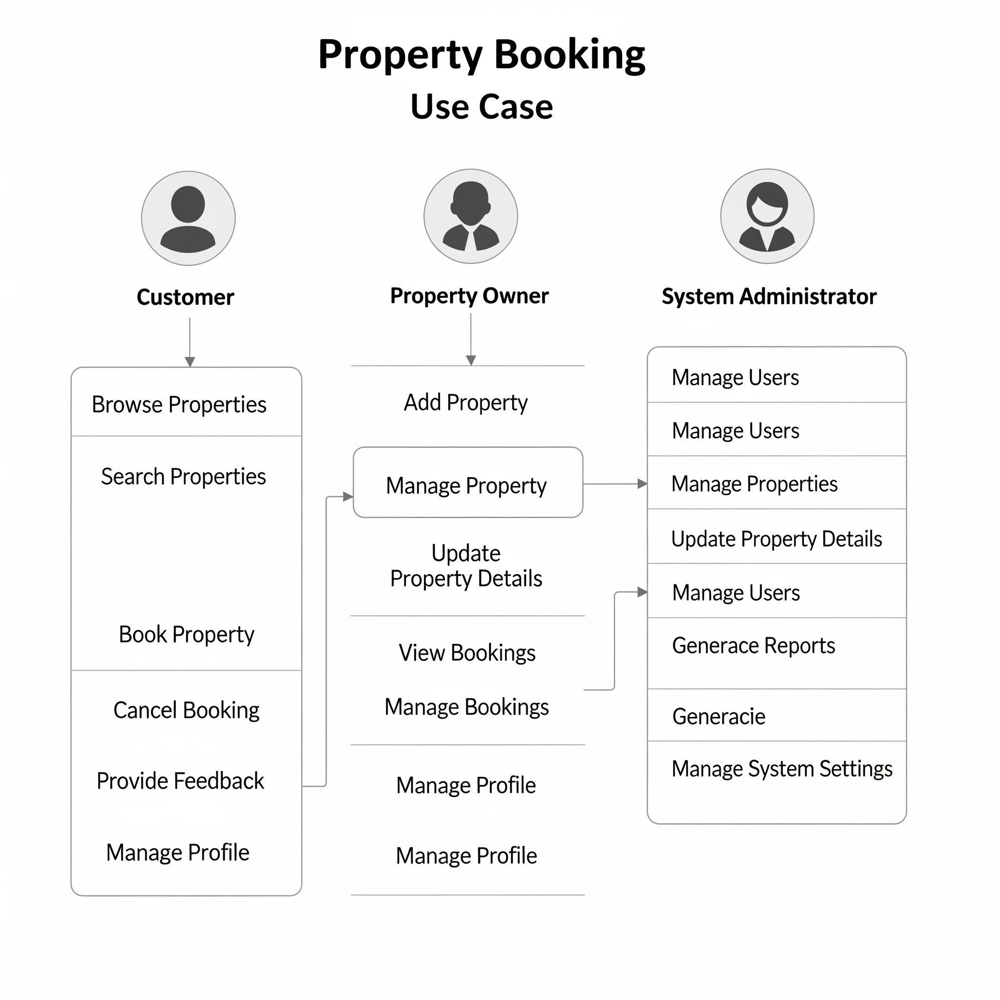

# Requirement Analysis in Software Development

This repository contains the Requirement Analysis Project, which simulates a real-world software development process by capturing, analyzing, and structuring requirements for a booking management system. The purpose of this repository is to demonstrate industry-standard practices in documenting functional and non-functional requirements, creating visual diagrams, and defining acceptance criteria.

By working through these tasks, we aim to establish a clear and well-organized blueprint for the software, ensuring that all project requirements are thoroughly understood and documented before the development phase begins. This foundation will help enhance clarity, scalability, and alignment with business and user goals, laying the groundwork for a successful software project.

## What is Requirement Analysis?

Requirement Analysis is the process of identifying, gathering, and documenting the needs and expectations of all stakeholders for a software system. It forms the very foundation of any successful software project. The goal is to ensure that everyone involved — clients, end-users, business analysts, and developers — shares a clear and accurate understanding of what the system must do before design and implementation begin.

Importance in the Software Development Lifecycle (SDLC)
Requirement Analysis is one of the most critical early stages of the Software Development Lifecycle. Its outcomes drive all the subsequent phases — design, coding, testing, deployment, and maintenance. Its key contributions include:

Defining Project Scope:
Clearly stated requirements help set the boundaries of the project. This prevents scope creep — the uncontrolled growth of project requirements — and keeps the project focused.

Aligning Stakeholder Expectations:
By thoroughly capturing and agreeing on requirements up front, all stakeholders, including customers, product managers, and the engineering team, gain a shared understanding of the project's goals. This prevents costly misunderstandings later.

Improving Design and Development:
When requirements are well-structured and unambiguous, they help architects and developers create software that precisely matches the intended purpose. This reduces the need for expensive rework or last-minute fixes.

Supporting Accurate Estimates:
Well-documented requirements enable teams to estimate the time, effort, and resources more realistically. This is vital for planning schedules, allocating resources, and setting realistic deadlines.

Ensuring Quality and User Satisfaction:
Detailed requirements help testers create thorough test cases. When the software is eventually tested against its acceptance criteria, it’s easier to verify that the product meets the users’ needs — resulting in higher satisfaction.

Conclusion
In short, Requirement Analysis is a core pillar of SDLC because it lays the groundwork for all further phases. Getting this stage right not only improves efficiency and predictability during the project but also significantly increases the likelihood of delivering a robust, high-quality product that meets or exceeds expectations. Without proper Requirement Analysis, projects often face misaligned objectives, delays, and cost overruns — all of which can be avoided by investing time and attention at the very beginning.

### Why is Requirement Analysis Important?

1️⃣ Reduces Miscommunication and Aligns Stakeholders
Requirement Analysis provides a structured process for gathering, documenting, and validating requirements. This ensures that all stakeholders — including clients, end-users, and the development team — have a shared understanding of the software’s purpose, scope, and constraints. By aligning everyone early on, the risk of misinterpretation and costly changes later in the SDLC is greatly reduced.

2️⃣ Improves Estimation and Project Planning
Well-defined requirements allow for more accurate estimates of time, cost, and resources. This enables project managers and teams to plan schedules, allocate tasks, and manage risks more effectively. Without proper analysis at the start, teams may face scope creep and unforeseen obstacles that can derail timelines and budgets.

3️⃣ Enhances Product Quality and User Satisfaction
When the desired features, behaviors, and constraints are documented thoroughly, designers and developers can build a product that meets real user needs. Clear requirements also help testers create precise test cases, ensuring that the final product matches the business goals and user expectations — resulting in higher quality and greater customer satisfaction.

####Key Activities in Requirement Analysis

Requirement Gathering

Involves collecting information about the desired system from all relevant sources — stakeholders, clients, end-users, and domain experts.

Techniques like interviews, surveys, observations, and workshops help capture what the system is supposed to do.

Requirement Elicitation

Focuses on facilitating communication between the project team and stakeholders to draw out deeper, often implicit, needs.

Tools like use case scenarios, brainstorming sessions, and prototyping can help uncover requirements that stakeholders may not have articulated initially.

Requirement Documentation

Once gathered, requirements are clearly and systematically documented in forms such as Software Requirement Specifications (SRS), use cases, or user stories.

This ensures that all requirements are accessible, traceable, and verifiable throughout the SDLC.

Requirement Analysis and Modeling

Examines the requirements to check for feasibility, conflicts, or inconsistencies and organizes them into logical groupings.

Visual models like data flow diagrams, entity-relationship diagrams, or use case diagrams can help illustrate system processes and interactions.

Requirement Validation

Involves verifying that the documented requirements align with stakeholder needs and are technically and economically feasible.

Formal reviews, walkthroughs, and sign-off processes help confirm that the requirements will lead to a successful final product.

#####Types of Requirements
 Subsection 5.1
Functional Requirements
Functional requirements describe the specific features and behaviors that the booking management system must support. They define what the system must do to meet business and user goals.

Examples for the booking management project:

The system shall allow customers to search for available rooms by date, room type, and capacity.

The system shall enable customers to make, view, modify, and cancel bookings online.

The system shall send a booking confirmation email with booking details once a reservation is successful.

The system shall allow administrators to add, update, or remove rooms and manage pricing.

The system shall generate booking reports for each day and allow them to be exported as PDF or CSV.

  Subsection 5.2
Non-functional Requirements
Non-functional requirements describe how the system performs its tasks, specifying the overall qualities like performance, security, and usability that contribute to a good user experience.

Examples for the booking management project:

The system shall process and confirm booking transactions within 2 seconds under a typical load of 100 concurrent users.

The system shall use secure encryption (e.g., SSL/TLS) to protect all customer data and transactions.

The user interface shall be responsive and accessible on desktops, tablets, and mobile phones.

The system shall maintain 99.9% uptime to ensure availability for customers at all times.

The system shall comply with applicable privacy and data protection laws (e.g. GDPR) to protect user data.

######Acceptance Criteria
Acceptance Criteria define the specific conditions a feature must meet to be considered complete and accepted by users or stakeholders. They help ensure clarity, guide development and testing, and reduce misunderstandings.

✅ Example: Checkout Feature (Booking System)
Feature: Customer completes a room booking checkout.

Acceptance Criteria:

User must be logged in.

Booking summary (room, dates, price) is shown.

Valid payment details are required.

Availability is checked before confirming.

Confirmation email is sent after successful booking.

Error message shown if payment fails.

